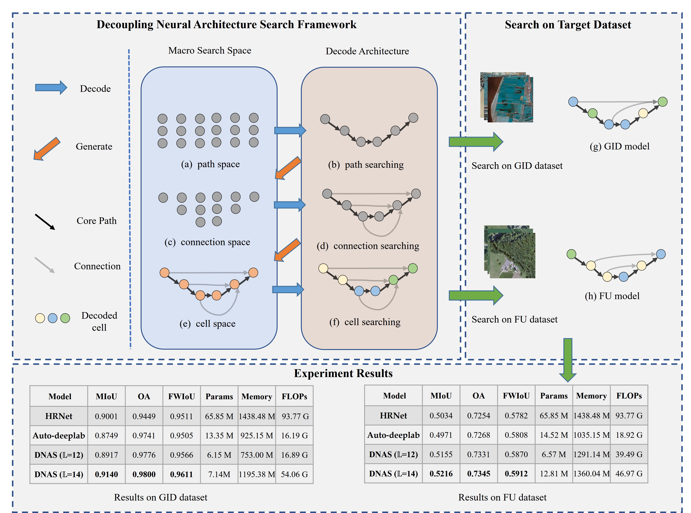
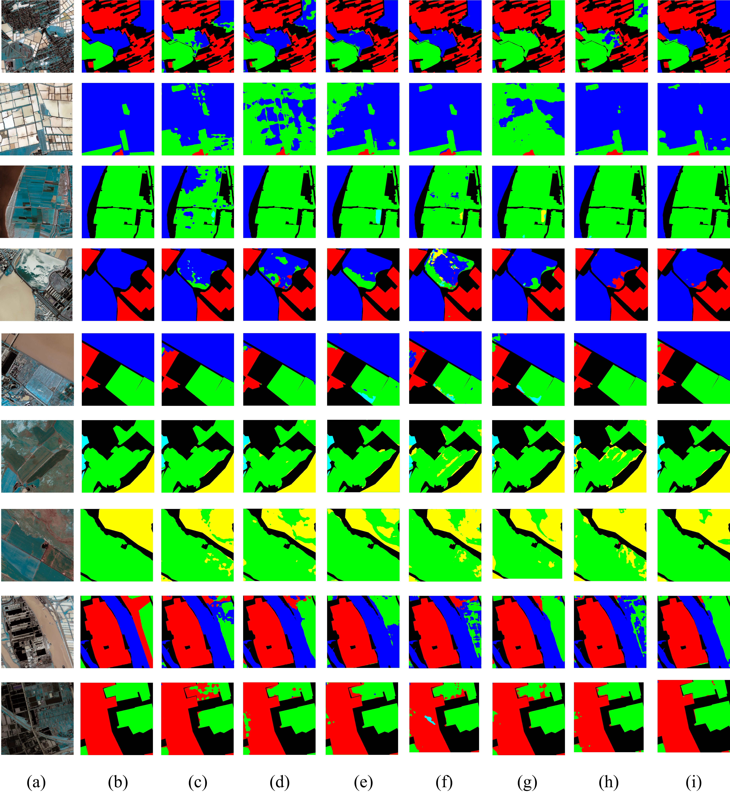

# DNAS

Code for paper：

[DNAS: Decoupling Neural Architecture Search for High-Resolution Remote Sensing Image Semantic Segmentation.](https://www.mdpi.com/2072-4292/14/16/3864)

In DNAS, a hierarchical search space with three levels is recommended: path-level, connection-level, and cell-level. To adapt to this hierarchical search space, we devised a new decoupling search optimization strategy to decrease the memory occupation. More specifically, the search optimization strategy consists of three stages: (1) a light super-net (i.e., the specific search space) in the path-level space is trained to get the optimal path coding; (2) we endowed the optimal path with various cross-layer connections and it is trained to obtain the connection coding; (3) the super-net, which is initialized by path coding and connection coding, is populated with kinds of concrete cell operators and the optimal cell operators are finally determined. It is worth noting that the well-designed search space can cover various network candidates and the optimization process can be done efficiently.

Methods' framework


---

## Requirement

One GPU (video memory greater than 12GB)

* python>=3.8.13
* numpy>=1.22.3
* pytorch>=1.10.0
* pillow>=9.0.1
* opencv>=4.5.4
* tqdm>=4.62.3
* torchstat>=0.0.7

## Dataset

We use the GID-5 dataset in this rep. The original image of size 6800 × 7200 and the corresponding label are cut into blocks of size 512 × 512. These blocks are randomly divided into a training set, a validation set, and a test set in a ratio of 6:2:2. 

The list file in [list_dir](./data/lists/GID/). You can Download these blocks from [OneDrive]() or [BaiduNetDisk](https://pan.baidu.com/s/1jLTOf9PktWDvJZXBy2hFSg)(code: 1111), and move it to the [data](./data/) dir 

## Model Zoo

|   Methods   |  mIoU  | GFLOPs | Params |  Memory  |                            Model                             |
| :---------: | :----: | :----: | :----: | :------: | :----------------------------------------------------------: |
| DNAS (L=12) | 0.8917 | 16.89  | 6.15 M | 753.0 M  | [BaiduNetDisk](https://drive.google.com/file/d/1Fa4hLS2GKL90HR0tVhmcZkFwemK6DlgT/view?usp=sharing) |
| DNAS (L=14) | 0.9140 | 54.06  | 7.14 M | 1195.4 M | [BaiduNetDisk](https://drive.google.com/open?id=1o31jNkoSMugK0rEsi6grE9WEioWJgsZN) |

## Simple Use the Searched and Trained Model

Take DNAS (L=14) model as an example, download it and move to the [model_encode](./model/model_encode/) dir

* Test model mIoU, GFLOPS, params, and memory

```bash
cd tools && python test_retrain_model.py
```

* Use the trained model predict

```bash
sh predict.sh
```

Predict result samples


(a) and (b) are raw images and ground truth, respectively. (c) and (d) are the results of PSPNet and the results of Deeplabv3+, respectively. The results of HRNet and the results of MSFCN are shown in (e) and (f), respectively. (g) presents the results of Auto-deeplab, and (h) presents the results of Fast-NAS. The results of our proposed DNAS are displayed in (i).
## Train the Searched Model on Target Dataset

Take DNAS (L=14) model and GID-5 dataset as an example, download model encode file and move to the [model_encode](./model/model_encode/) dir. 

* Make a personal dataset in dataloaders dir

```python
class GIDDataset(Dataset):
```

* Run the Retrain

```
sh retrain.sh
```

### Search Model on Target Dataset

* Search process(Need change some config path in .sh file between command line)

```bash
sh ./experiments/stage1_encode.sh # Create first stage connections
sh ./experiments/stage1_search.sh # Train the first surpernet
sh ./experiments/stage2_encode.sh # Create second stage connections
sh ./experiments/stage2_search.sh # Train the second surpernet
sh ./experiments/stage3_encode.sh # Create third stage connections
sh ./experiments/stage3_search.sh # Train the third surpernet
sh ./experiments/stage3_search.sh # Train the third surpernet
sh ./experiments/retrain_encode.sh # Decode the third result and create retrain cell structure
```

* Finally, retrain the searched model:

```bash
sh ./experiments/retrain.sh
```

## Citation

Consider cite the DNAS in your publications if it helps your research. 

```
@Article{rs14163864,
AUTHOR = {Wang, Yu and Li, Yansheng and Chen, Wei and Li, Yunzhou and Dang, Bo},
TITLE = {DNAS: Decoupling Neural Architecture Search for High-Resolution Remote Sensing Image Semantic Segmentation},
JOURNAL = {Remote Sensing},
URL = {https://www.mdpi.com/2072-4292/14/16/3864},
DOI = {10.3390/rs14163864}
}
```

Consider cite this project in your publications if it helps your research. 

```
@misc{DynamicRouting,
    author = {Wang Yu},
    title = {DNAS},
    howpublished = {\url{https://github.com/faye0078/DNAS}},
    year ={2022}
}
```